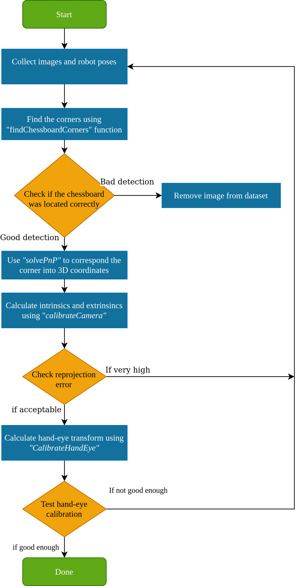

# HandEyeCalibration

This code is an openCV implementation for Handeye calibration. The implementation is done using this flowchart:




To use this code is contained in HandEyeCalibration_class.py

The file describes a class named CameraCalibration with 4 mandatory inputs:

image_folder - a folder containing images of a chessboard. The images names should be color_images_xxx.npz where xxx is image number

Transforms_folder - a folder containing the transforms from the base of the robot to the end effector. The transforms should be named T_base2ee_xxx.npz. where xxx is the number. 
    It is important that the numbers in the transformations and the Images correspond to the same isntance. For example color_image_001 was taken at the same time as T_base2ee_001.npz
    
pattern_size: the number of corners in the chessboard pattern, default is (4,7)

square_size: the size of the squares in the chessboard pattern, default is 33/1000. 
The units in the transforms and the square size need to be the same!!


Output:
The output of this class is 12 files, each correspond do a different method in the HandEye calibration functions in openCV
The class will also output the images with the detected corners for verification


An example is included in the folder Cal2 and within the HandEyeCalibration_class.py

## Installation

1. Clone this repository:
```bash
git clone https://github.com/JonesCVBS/HandEyeCalibration-using-OpenCV.git
```

2.Change directory to the cloned repository:

```bash
cd HandEyeCalibration-using-OpenCV
```

3.Install the required dependencies using the requirements.txt file:

```bash
pip install -r requirements.txt
```
